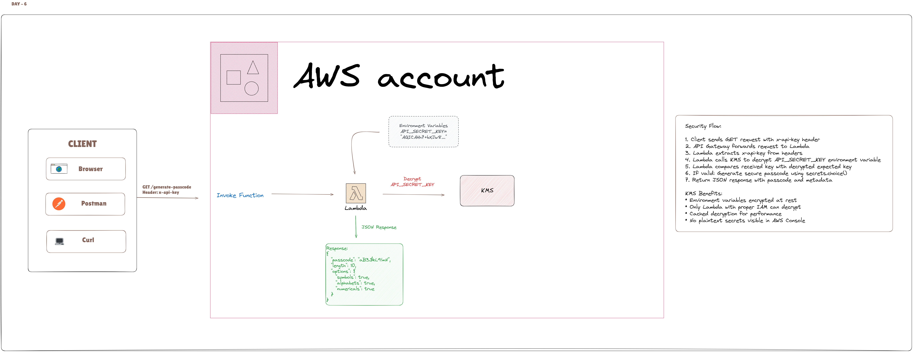

# Random Passcode Generator API

A secure AWS Lambda function that generates random passcodes with configurable character sets and length. Features KMS encryption for environment variables and comprehensive error handling.

## 🏗️ Architecture



**Security Flow:**

1. **Client Request** → HTTP Trigger → Lambda Function
2. **Authentication** → Lambda extracts `x-api-key` from headers
3. **KMS Decryption** → Lambda decrypts `API_SECRET_KEY` environment variable
4. **Validation** → Compare keys and validate parameters
5. **Generation** → Create secure passcode using `secrets.choice()`
6. **Response** → Return JSON with passcode and metadata

**Key Security Features:**
- Environment variables encrypted with AWS KMS
- API key validation with cached decryption
- Cryptographically secure random generation
- No sensitive data in logs or storage

## 🔐 Security Features

- **KMS Encryption**: Environment variables encrypted at rest and in transit
- **API Key Authentication**: Header-based authentication with encrypted storage
- **Input Validation**: Comprehensive parameter validation and sanitization
- **Error Handling**: Structured error responses with proper HTTP status codes

## 📋 API Specification

### Endpoint
```
GET /generate-passcode
```

### Authentication
```
Header: x-api-key: <your-secret-key>
```

### Parameters
| Parameter | Type | Default | Range | Required |
|-----------|------|---------|-------|----------|
| `length` | integer | 10 | 8-10 | No |
| `symbols` | boolean | true | Must be true | No |
| `alphabets` | boolean | true | Must be true | No |
| `numericals` | boolean | true | Must be true | No |

### Response Format
```json
{
  "passcode": "aB3$kL9!mN",
  "length": 10,
  "options": {
    "symbols": true,
    "alphabets": true,
    "numericals": true
  }
}
```

## 🚀 Quick Start

### HTTP Trigger Options

This Lambda function works with any HTTP trigger:
- **Lambda Function URLs** (simplest for testing)
- **API Gateway** (for production APIs)
- **Application Load Balancer** (ALB)
- **Direct SDK invocation** (programmatic access)

### 1. Deploy to AWS Lambda

```bash
# Package the function
zip function.zip lambda_function.py

# Create IAM role (replace ACCOUNT_ID)
aws iam create-role --role-name passcode-lambda-role \
  --assume-role-policy-document file://trust-policy.json

# Deploy Lambda
aws lambda create-function \
  --function-name passcode-generator \
  --runtime python3.12 \
  --role arn:aws:iam::ACCOUNT_ID:role/passcode-lambda-role \
  --handler lambda_function.lambda_handler \
  --zip-file fileb://function.zip
```

### 2. Set Up KMS Encryption

```bash
# Create KMS key
aws kms create-key --description "Lambda environment encryption"

# Set environment variable (replace KEY_ID and SECRET)
aws lambda update-function-configuration \
  --function-name passcode-generator \
  --environment Variables={API_SECRET_KEY=your-secret-key} \
  --kms-key-arn arn:aws:kms:region:account:key/KEY_ID
```

### 3. Test the API

```bash
curl -X GET "https://your-lambda-url/generate-passcode?length=10" \
  -H "x-api-key: your-secret-key"
```

## 🔑 Why KMS Encryption?

### The Problem
Without encryption, anyone with Lambda read access can see your API keys in plaintext:

```bash
# Visible in AWS Console
API_SECRET_KEY = "super-secret-key-123"  # ❌ Security risk
```

### The Solution
KMS encryption protects secrets from unauthorized access:

```bash
# Encrypted in AWS Console
API_SECRET_KEY = "AQICAHh7+bXJw8..."  # ✅ Secure
```

### Benefits of KMS vs Alternatives

| Feature | Environment Variables | KMS Encryption | Secrets Manager |
|---------|----------------------|----------------|-----------------|
| **Cost** | Free | ~$1/month | ~$3/month |
| **Security** | Low | High | Highest |
| **Setup Complexity** | Simple | Medium | Complex |
| **Auto Rotation** | ❌ | ❌ | ✅ |
| **Performance** | Fast | Fast | Slower (API calls) |

**KMS is the sweet spot** for most APIs: strong security without the complexity and cost of Secrets Manager.

## 🔧 How KMS Encryption Works

### Encryption Process

1. **Create KMS Key**: AWS generates a master encryption key
2. **Encrypt Variable**: Lambda encrypts your secret using the KMS key
3. **Store Encrypted**: Only the encrypted blob is stored in Lambda config
4. **Runtime Decryption**: Lambda automatically decrypts when your function runs

### Code Implementation

```python
import boto3
from botocore.exceptions import ClientError

# Initialize KMS client
kms = boto3.client('kms')

def decrypt_env_var(env_var_name):
    """Decrypt KMS-encrypted environment variable with caching"""
    encrypted_value = os.environ.get(env_var_name)
    
    try:
        # Attempt KMS decryption
        response = kms.decrypt(CiphertextBlob=encrypted_value.encode())
        return response['Plaintext'].decode()
    except ClientError:
        # Fallback to plaintext (backward compatibility)
        return encrypted_value
```

### Security Flow

```
User Request → HTTP Trigger → Lambda Function
                              ↓
                          Check x-api-key header
                              ↓
                          Decrypt API_SECRET_KEY (KMS)
                              ↓
                          Compare keys → Authorize/Reject
```

## 📖 Code Explanation

### Core Components

#### 1. Character Sets
```python
SYMBOLS = "!@#$%^&*()_+-=[]{}|;:,.?"      # Special characters
ALPHABETS = string.ascii_letters            # a-z, A-Z
NUMERICALS = string.digits                  # 0-9
```

#### 2. KMS Decryption with Caching
```python
_decrypted_cache = {}  # Cache to avoid repeated KMS calls

def decrypt_env_var(env_var_name):
    # Check cache first
    if env_var_name in _decrypted_cache:
        return _decrypted_cache[env_var_name]
    
    # Decrypt and cache result
    encrypted_value = os.environ.get(env_var_name)
    response = kms.decrypt(CiphertextBlob=encrypted_value.encode())
    decrypted_value = response['Plaintext'].decode()
    _decrypted_cache[env_var_name] = decrypted_value
    return decrypted_value
```

**Why caching?** KMS calls cost money and add latency. Caching ensures we decrypt once per Lambda container lifecycle.

#### 3. Authentication Flow
```python
# Extract and normalize headers
headers = {k.lower(): v for k, v in (event.get("headers") or {}).items()}
api_key = headers.get("x-api-key")

# Get expected key (decrypted from KMS)
expected_key = decrypt_env_var("API_SECRET_KEY")

# Validate
if not api_key or api_key != expected_key:
    return error_response(401, "UNAUTHORIZED", "Missing or invalid API key")
```

#### 4. Parameter Validation
```python
def parse_bool(value, param_name):
    if value is None:
        return True, None  # Default to true
    if value.lower() == "true":
        return True, None
    if value.lower() == "false":
        return False, None
    return None, param_name  # Invalid value
```

#### 5. Secure Random Generation
```python
# Use cryptographically secure random
charset = SYMBOLS + ALPHABETS + NUMERICALS
passcode = "".join(secrets.choice(charset) for _ in range(length))
```

**Why `secrets` module?** Unlike `random`, the `secrets` module is cryptographically secure and suitable for passwords.

### Error Handling Strategy

The API uses structured error responses:

```python
def error_response(status_code, code, message):
    return {
        "statusCode": status_code,
        "headers": {"Content-Type": "application/json"},
        "body": json.dumps({"error": {"code": code, "message": message}})
    }
```

**Error Categories:**
- `401 UNAUTHORIZED`: Authentication failures
- `400 INVALID_LENGTH`: Length validation errors  
- `400 NO_CHARSET`: Character set validation errors
- `400 INVALID_PARAM`: Parameter format errors
- `405 METHOD_NOT_ALLOWED`: HTTP method errors
- `500 INTERNAL_ERROR`: Unexpected server errors

## 🛠️ Setup Instructions

### Step 1: Create KMS Key

1. Go to AWS Console → KMS → Create Key
2. Choose "Symmetric" → "Encrypt and decrypt"
3. Set alias: `lambda-env-encryption`
4. Copy the Key ARN

### Step 2: Configure Lambda Environment

1. Go to Lambda → Configuration → Environment variables
2. Add: `API_SECRET_KEY` = `your-secret-key`
3. Enable "Encryption in transit"
4. Select your KMS key
5. Click "Encrypt" next to the variable

### Step 3: Update IAM Permissions

Attach this policy to your Lambda execution role:

```json
{
  "Version": "2012-10-17",
  "Statement": [
    {
      "Effect": "Allow",
      "Action": ["kms:Decrypt"],
      "Resource": "arn:aws:kms:region:account:key/your-key-id"
    }
  ]
}
```

### Step 4: Deploy and Test

```bash
# Update function code
zip function.zip lambda_function.py
aws lambda update-function-code \
  --function-name passcode-generator \
  --zip-file fileb://function.zip

# Test
curl -X GET "https://your-lambda-url/generate-passcode" \
  -H "x-api-key: your-secret-key"
```

## 🔍 Monitoring and Debugging

### CloudWatch Logs
```bash
# View logs
aws logs tail /aws/lambda/passcode-generator --follow
```

### Common Issues

**401 Unauthorized:**
- Check environment variable exists
- Verify KMS permissions
- Confirm header name is `x-api-key` (lowercase)

**500 Internal Error:**
- Check CloudWatch logs for KMS permission errors
- Verify Lambda execution role has KMS decrypt permissions

### Debug Mode
Add logging to troubleshoot:

```python
print(f"Received headers: {headers}")
print(f"API key from header: {api_key}")
print(f"Expected key exists: {expected_key is not None}")
```

## 📊 Performance Considerations

- **Cold Start**: ~150ms (includes KMS decryption)
- **Warm Start**: ~2ms (uses cached decrypted values)
- **Memory Usage**: ~45MB
- **KMS Calls**: 1 per container lifecycle (cached afterward)

## 🔒 Security Best Practices

1. **Rotate API Keys**: Change keys periodically
2. **Monitor Access**: Review CloudWatch logs regularly
3. **Least Privilege**: Grant minimal IAM permissions
4. **Network Security**: Use VPC if handling sensitive data
5. **Input Validation**: Never trust user input

## 📝 License

This project is licensed under the MIT License.